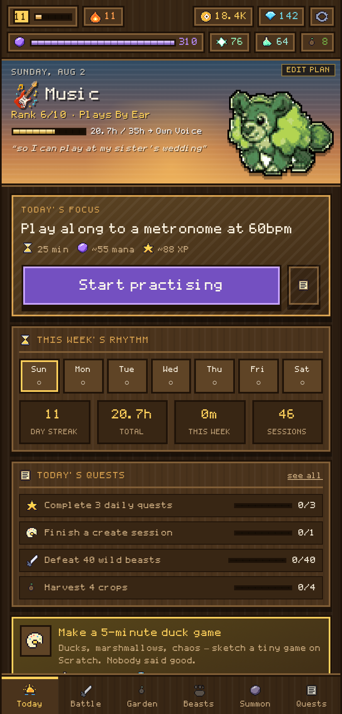
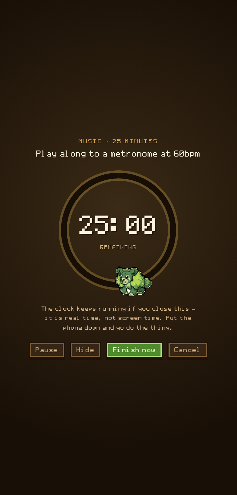
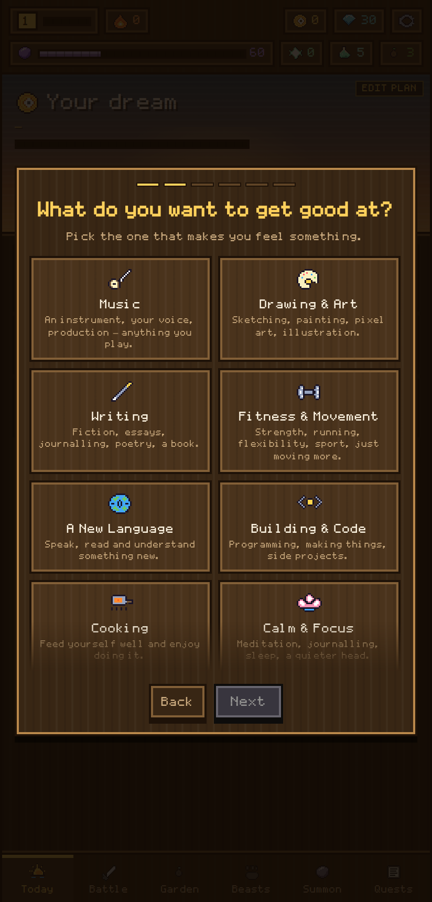
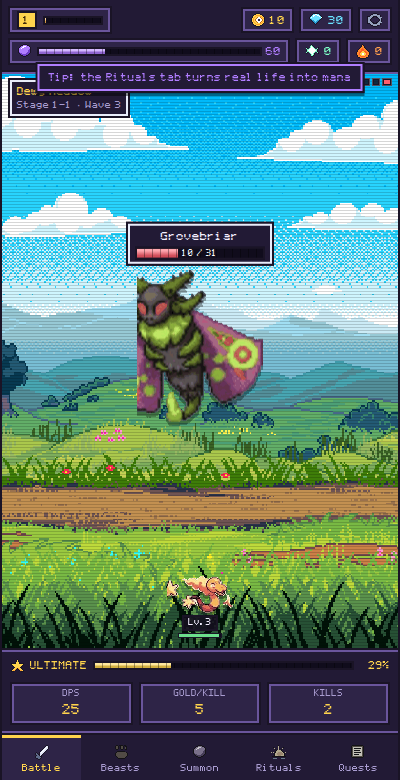
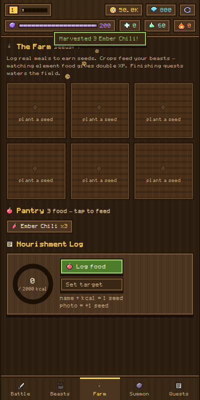
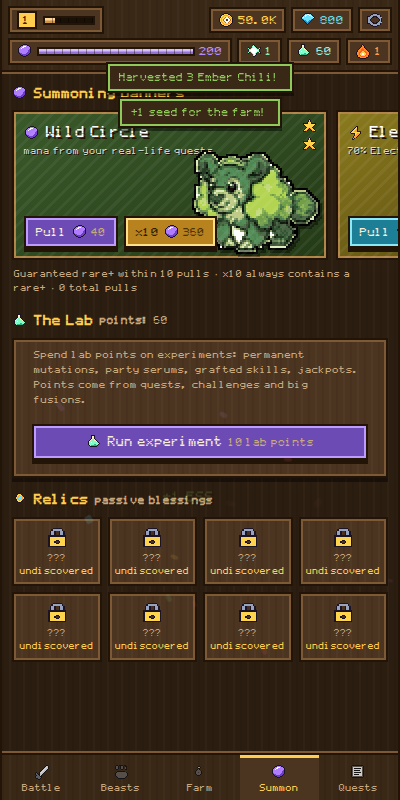
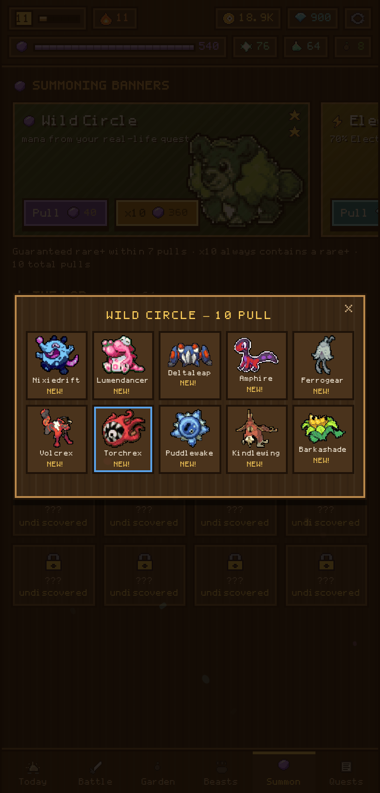
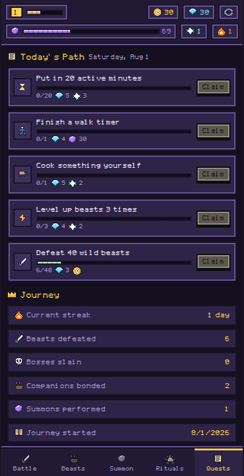
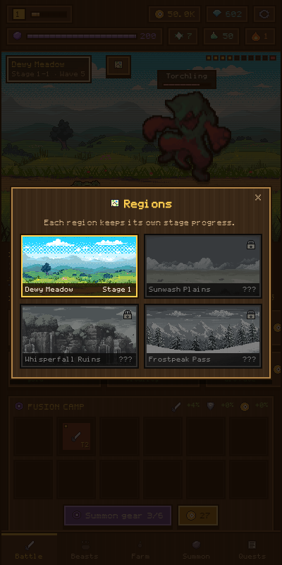
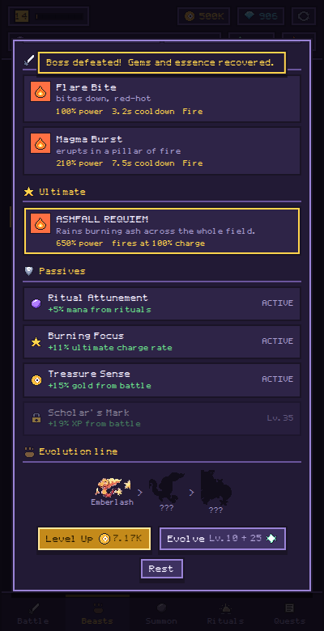

# Hourling

**The hours you actually put in grow into something alive.** Pick one thing you have always
meant to get good at (music, drawing, writing, fitness, a language, code, cooking, calm,
craft, photography, a subject, dance) and Hourling turns it into a plan: one concrete task a
day, a weekly rhythm you choose, and a 10-rung ladder measured in real practised hours.
Every minute you log becomes mana, XP and evolution essence for a world of 291 collectible
pixel beasts, each with its own dex entry, skills, signature move and ultimate.

No installs, no build step, no server. Open `index.html`, or grab the single-file build in
`dist/hourling.html` and open that anywhere — every asset is inlined and it makes no network
requests at all.

### Install it on a phone

* **iOS** — open it in Safari and *Add to Home Screen*. You get a real standalone launch
  with the app icon and no browser chrome, via the `apple-*` meta tags.
* **Android** — Chrome will show the name and icon, but a fully installed WebAPK and offline
  launch need a service worker, and a service worker cannot be registered from a single
  self-contained file. So treat Android as a bookmark, not an install.
* Either way there is no offline cache: each cold start re-downloads the bundle.

### Accounts, backup and sync

* **Profiles are local.** Up to four named saves live side by side in one browser. They
  never leave the device.
* **A backup code is the only way progress travels** — your save, gzipped and base64'd
  (about 1.3KB of text), which you paste into another browser.
* **Google sign-in is identity only, and it is off until you supply your own OAuth client
  ID.** There is no shared client ID to ship and Google requires the exact serving origin to
  be registered. Even once it works, with no backend the ID token cannot be verified, so it
  proves nothing, gates nothing and syncs nothing — it can show your name and that is all.
  Real cross-device sync would need a server this app does not have.

### About the "free rewards"

There are **no adverts in this app and nothing costs money**. The reward offers are served
by Hourling itself: a fifteen-second practice tip, a daily double-up, and a reflection
prompt that pays gems for one honest line about your practice. The tip card is labelled
*not an ad* in its own markup, its timer only advances while the card is actually on screen,
and skipping forfeits the reward. Real ad inventory is impossible here (no ad account, no
controlled domain) and faking a sponsor would be dishonest, so neither is done.

| Today | Session timer | Onboarding |
|---|---|---|
|  |  |  |

| Battle + fusion camp | Garden | Gacha banners |
|---|---|---|
|  |  |  |

| 10-pull | Quests + login | Region map | Beast page |
|---|---|---|---|
|  |  |  |  |

**v5 — Hourling.** Renamed, and shipped as an actual mobile app: the single-file build now
emits a real HTML document (it previously started at `<title>` with no doctype, charset or
viewport, so phones rendered a 3.4MB bundle at desktop width), plus a runtime web-app
manifest, an opaque app icon set, a branded boot splash, safe-area insets and haptics. New
typography — Plus Jakarta Sans for text, Gabarito for headings and every counter, both
variable, both with real tabular figures. The Forge replaces the fusion camp: gear now has
rarity that multiplies its whole contribution, and gems buy board slots, the tier ceiling,
spawn luck, wheel charge and the **rarity ceiling** itself, while scrapping junk yields
shards that push a chosen piece's tier or rarity. Local profiles, gzipped backup codes and
an honest Google sign-in setup card. And a free-rewards slot that is genuinely free.

**v4.1 — the uploaded art is in.** Six tiered equipment sheets, ten crop
sheets and thirty hobby icons were cut up by `tools/extract-new-art.py` and
wired straight into the game: the fusion camp now shows real gear that visibly
climbs from a wooden club to a winged legendary across its nine tiers, the
garden grows drawn crops through four stages per element, and every dream card
carries its own illustration.

**v4 — Dreamkeep:** a six-question onboarding that builds your plan (dream → experience →
minutes → days → why → a starter that shares your dream's element), a **Today** home screen
with the day's focus task, a full-screen real-time session timer, a weekly rhythm strip and
a practice journal, a real farm scene (tilled soil, fence, scarecrow, butterflies, drifting
clouds, four hand-drawn growth stages per element), battle fighters that actually run at
their target and strike, per-skill cooldown bars under the scene, and VFX 2.0 with additive
glow, particle trails and hitstop.

**v3:** warm wood/nature UI, packs of up to 3 enemies that walk in (attack dashes, death
falls, party advances between waves), cookie-clicker battle upgrades, a merge board under
the battle scene (portal-spawned weapons/armor/charms, drag to fuse tiers, board-wide party
boosts), a real-time farm growing 9 element foods that level your beasts (seeds come from
logging real meals — a photo earns a bonus seed), Genshin-style element banners with 10-pulls
and a wish animation, The Lab (lab-point gacha: mutations, serums, skill grafts), 7-day login
rewards, a personalized challenge-of-the-day with real links (GeoGuessr, Scratch, Wordle…),
a quest log on the battle screen, timed cache-digging encounters, a region map, and a defeat
screen that tells you how to come back stronger. Every sprite reviewed individually at full size across three audit passes and normalized
to one pixel density (tools/pixelate.py).

## How real life powers the game

The main loop is one **practice session**: tap start, do the actual thing, come back. Rewards
scale with the real minutes, and the beast that shares your dream's element gains 80% more XP
than the rest of the party.

| You do this (for real) | The game gives you |
|---|---|
| **Finish a practice session** | ~2.2 mana + 3.5 XP per minute, essence, seeds, lab points — and it waters the whole garden |
| Reach a new rung on the ladder | A rank-up screen and a new title on your dream |
| Morning check-in | Dawn Blessing: +15% gold & XP for 4 hours |
| Drink a glass of water (×8/day) | +12 mana toward your next summon |
| Log a healthy meal | Mana + XP + essence, and it feeds the calorie ring |
| Cook something | Bonus essence |
| Finish the day within your calorie target | Gems + essence bonus the next morning |
| Walk (real countdown timer) | Minutes → mana & essence |
| Exercise session (real timer: 10–60 min) | **x3 idle rewards for twice the duration** + essence |
| Create / practice (real timer) | Deep-work minutes → essence |
| Your own custom rituals | Mana + XP, once per day |

Habits are never punished — missing a day just pauses your streak bonus. The tone is
"feed your beasts", not "you failed".

## Every beast has a kit

Each of the 297 creatures gets its own deterministic loadout, derived from its id so it is
identical every session:

- **2 active skills** — a fast basic and a heavier hitter, each typed, on its own cooldown,
  with a matching pixel effect and an on-screen name banner when it fires.
- **1 ultimate** — charges as your party deals damage; on release it flashes the screen,
  shakes the scene and lands a hit worth several hundred percent of a normal attack.
- **4 passives** — unlocked at levels 5 / 12 / 22 / 35. They feed the whole party: attack,
  vitality, crit, gold, mana, essence, XP, attack speed, ultimate charge rate, lifesteal.
- **A dex entry** — habitat, temperament, and a line about how the beast responds to *your*
  consistency, written from the creature's type, stage and rarity.

## The game around it

- **Idle auto-battler** — your party of up to 4 beasts fights waves across 4 areas
  (Dewy Meadow, Sunwash Plains, Whisperfall Ruins, Frostpeak Pass), 10 stages each, looping
  into higher tiers. Wave 10 is a timed boss.
- **288 creatures** with 9 elemental types, a type-effectiveness chart, party synergy,
  rarities up to legendary, and **26 evolution lines** — evolving needs levels *and* essence,
  which only real-life rituals produce in volume.
- **Summoning** — mana or gems fuel the circle, with pity protection and relic drops.
- **Your dream, planned** — 12 dreams, each with an element affinity, four difficulty tiers
  of concrete focus tasks (60 per dream), and its own 10-name milestone ladder from
  *First Sound* to *Maestro*. The plan is editable any time from the Today hero.
- **Vale's tasks** — the tutorial is a board, not a tour. Seven starter tasks from
  Professor Vale, each a real thing to go and do, each paying gems and gold, all ticked
  off by reading the game's own state rather than by watching you tap. Nothing dims the
  screen and nothing has to be sat through; finishing the last one pays 100 gems.
- **Personalized quests** — the daily quest board and the challenge-of-the-day are drawn
  from the tags your dream maps to, so a writer gets different work from a runner.
- **Weekly events** — one of six events runs at a time and rotates every Monday, chosen by
  the week number rather than a roll, so it is the same all week and the next one is
  predictable. Each applies a modifier inside the grant functions themselves (Gold Rush
  doubles every coin, Harvest Moon doubles seeds and yields, Ember Festival doubles XP),
  and each carries a five-tier reward track that fills from real activity — practice
  minutes, quests claimed, timers finished, bosses beaten. Unclaimed tiers are lost when
  the week turns over.
- **Offline progress** — your party keeps fighting while you're away (up to 12h); an active
  exercise boost multiplies it.

## Look and feel

Everything on screen is custom pixel art with no external dependencies:

- **RitualPixel**, a 5×7 bitmap font built glyph-by-glyph and compiled to a real TTF
  (`tools/make-font.py`), embedded as a data URI.
- **A 51-icon spritesheet** hand-authored as colour-keyed pixel maps
  (`tools/make-ui-art.py`) — currency, stats, elements, crops, dream icons, UI marks. No
  emoji anywhere.
- **A generated farm scene** (`tools/make-farm-art.py`) — seamless ploughed-earth tiles with
  wandering furrows, a fence strip, and watering can / scarecrow / butterfly / sun props.
- **Cut-up uploaded art** (`tools/extract-new-art.py`) — 54 gear sprites (6 types × 9 tiers),
  36 plant sprites (9 elements × 4 growth stages), 9 harvested crops and 34 hobby icons,
  all background-removed, re-hardened and quantized so the whole set costs ~145 KB.
- **Canvas VFX 2.0** (`js/vfx.js`) drawn on a virtual pixel grid in two passes — a solid
  pass with particle trails, then an additive glow pass: fire columns, water bursts,
  lightning bolts, ice shards, shadow rings, metal slashes, expanding shockwaves, plus
  impact flashes, hitstop, screen shake and the ultimate's full-screen flash.
- Chunky 2px borders, hard drop shadows, stepped animations, and segmented meters — the UI
  commits to one dark, cartridge-game world rather than following the viewer's theme.

## Tooling

The whole asset pipeline is in `tools/` and is re-runnable:

| Script | What it does |
|---|---|
| `tools/fix-sprites.py` | Repairs extraction defects — strips cell borders, dark background slabs and neighbouring art, splits fused cutouts, drops fragments, re-trims every sprite |
| `tools/gen-creatures.py` | Rebuilds `js/creatures-data.js` — types from hue analysis, evolution chains, rarities, base stats. Ids are stable, so saves survive a regeneration |
| `tools/make-font.py` | Compiles the bitmap font to TTF and writes `css/font.css` |
| `tools/make-ui-art.py` | Draws the 51-icon sheet, the 9-slice frames and `css/icons.css` |
| `tools/make-farm-art.py` | Draws the tilled soil tiles, fence and props |
| `tools/extract-new-art.py` | Cuts the uploaded art sheets in `assets/source-sheets/` into `gear.png`, `plants.png`, `crops.png` and `hobby.png` — background flood-fill from the borders (plus enclosed holes, so a ring reads as a ring), edge-bleed removal, group-relative scaling for growth stages, and palette quantization |
| `tools/pixelate.py` | Normalizes every sprite to one pixel density and gives it a uniform 1px outline |
| `tools/build-single.py` | Bundles everything into one self-contained HTML file |

Creature sprites were auto-extracted from the uploaded sprite-sheet compilations with a
background flood-fill and connected-component slicer, then audited sprite-by-sprite.

## Running it

```bash
python3 -m http.server 8000     # then open http://localhost:8000
```

Or open `dist/hourling.html` directly — one file, no server. Progress saves to
`localStorage` per browser.

Everything except the supplied sprite sheets is generated in-repo by the scripts in
`tools/` — the font, the UI icon sheet, the soil and fence tiles, and all VFX. Supplied art
is processed by `tools/extract-new-art.py` and `tools/pixelate.py`. There are no third-party
art downloads and no runtime dependencies.

*Creature and background pixel art from the uploaded Pinterest compilations; for personal use.*
