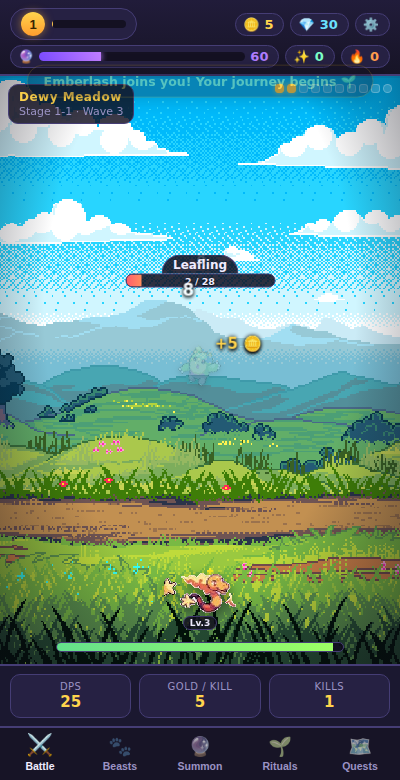
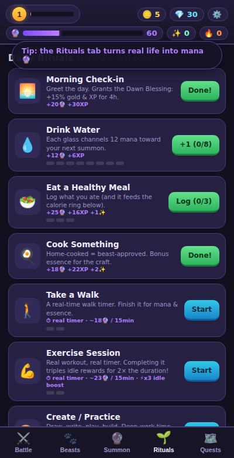
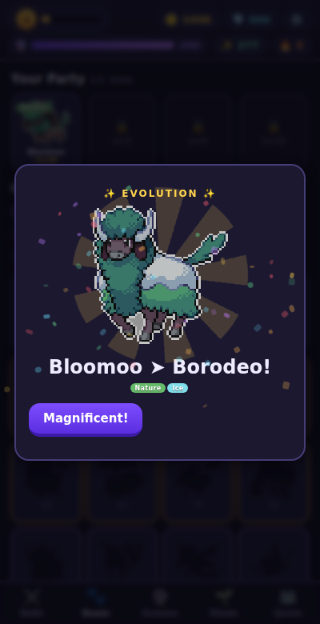
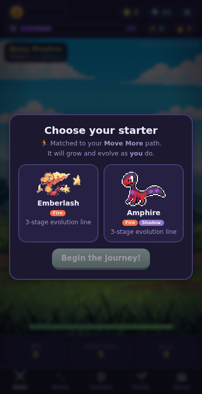
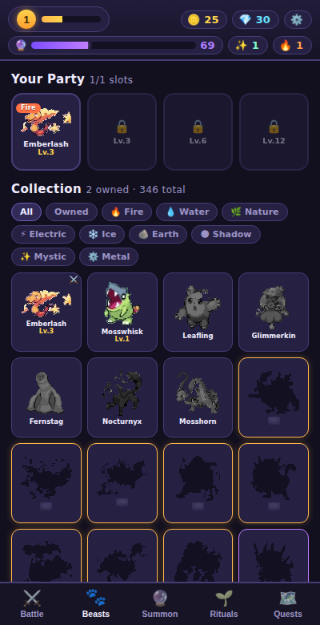
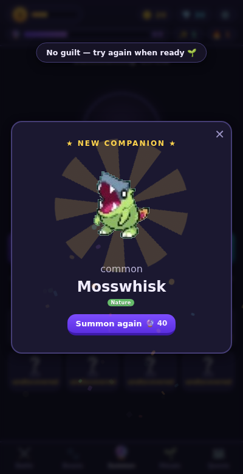
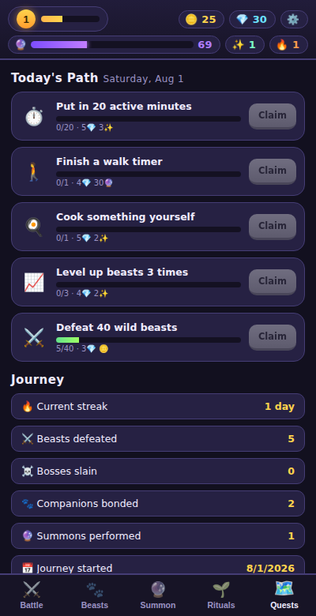

# 🌙 Ritual Beasts

**A habit-powered idle RPG.** Your real life is the power source: drink water, eat well,
cook, walk, exercise, and create — every real-world ritual becomes mana, XP and evolution
essence for a world of 346 collectible pixel beasts.

No installs, no build step, no server. Open `index.html` (or host with GitHub Pages) and play.

| Battle | Rituals | Evolution |
|---|---|---|
|  |  |  |

| Starter choice | Collection | Summons | Quests |
|---|---|---|---|
|  |  |  |  |

## How real life powers the game

| You do this (for real) | The game gives you |
|---|---|
| 🌅 Morning check-in | Dawn Blessing: +15% gold & XP for 4 hours |
| 💧 Drink a glass of water (×8/day) | +12 mana toward your next summon |
| 🥗 Log a healthy meal | Mana + XP + essence, and it feeds the calorie ring |
| 🍳 Cook something | Bonus essence |
| 🎯 Finish the day within your calorie target | Gems + essence bonus the next morning |
| 🚶 Walk (real countdown timer) | Minutes → mana & essence |
| 💪 Exercise session (real timer: 10–60 min) | **x3 idle rewards for twice the duration** + essence |
| 🎨 Create / practice (real timer) | Deep-work minutes → essence |
| ⭐ Your own custom rituals | Mana + XP, once per day |

Habits are never punished — missing a day just pauses your streak bonus. The tone is
"feed your beasts", not "you failed".

## The game around it

- **Idle auto-battler** — your party of up to 4 beasts fights waves across 4 hand-drawn
  areas (Dewy Meadow, Sunwash Plains, Whisperfall Ruins, Frostpeak Pass), 10 stages each,
  looping into higher tiers. Wave 10 is a timed boss with real rewards.
- **346 creatures** with 9 elemental types, a type-effectiveness chart, party synergy,
  rarities up to legendary, and **26 evolution lines** — evolution needs levels *and*
  essence, which only real-life rituals produce in volume.
- **Summoning** — mana (earned by living well) or gems fuel the summoning circle,
  with pity protection and relic drops (permanent passive items).
- **Personalized quests** — during onboarding you pick 1–2 life goals
  (Move More / Eat Better / Clear Mind / Create Daily); a matching starter line is offered
  and daily quests are generated from *your* goals.
- **Offline progress** — your party keeps fighting while you're away (up to 12h,
  extendable by relics); exercise boosts multiply it.
- **Dopamine, ethically sourced** — floating damage numbers, coin bursts, confetti,
  level-up fanfares, evolution reveals, streak flames, WebAudio chiptune SFX (mutable).

## Running it

```bash
# any static server works:
python3 -m http.server 8000
# then open http://localhost:8000
```

Or just double-click `index.html`. Progress saves to `localStorage` automatically.

## Tech

- Pure HTML/CSS/JS — zero dependencies, zero build step.
- All 346 creature sprites were auto-extracted from uploaded sprite-sheet compilations
  with a Python pipeline (background flood-fill removal, connected-component slicing,
  per-sheet heuristics), then typed by hue analysis and grouped into evolution lines.
- Backgrounds are the uploaded pixel-art landscapes (the waterfall one is an animated GIF).
- Sounds are synthesized live with WebAudio — no audio files.

*Creature and background pixel art from the uploaded Pinterest compilations; for personal use.*
